# Brazil container flows 2025

**Who carries Brazil's deep-sea containers, how long ships wait at the terminals, where the empties go and why, built from ANTAQ's port data and a vessel-by-vessel carrier mapping. The core year is 2025; the later notebooks add 2024 to separate seasonality from trend.**

I spent 17 years in freight forwarding negotiating ocean freight on Brazil trade lanes. Most of the numbers the market uses for Brazil (carrier shares, port congestion, empty repositioning) come from paid databases or from anecdote. This project rebuilds them from public data, and is explicit about where the data stops.

---

## Key findings

**2025 (notebook 02, ANTAQ panel extracts)**

| # | Finding | Figure |
|---|---|---|
| 1 | Median pre-berthing wait ranges from **2 h to 22 h** across the 11 main container terminals | [fig01](#1-waiting-time-varies-tenfold-between-terminals) |
| 2 | **54%** of the time container ships spend at those terminals is spent waiting to berth, not working | [fig02](#2-ships-spend-more-time-waiting-than-working) |
| 3 | Waiting rises in the second half of the year: **+8.2 h** in 2025, and about the same in 2024. It is seasonal, and 2025 as a whole was calmer than 2024 | [fig03](#3-waiting-rises-in-the-second-half-every-year) |
| 4 | **Maersk and MSC are neck and neck** in Brazil's deep-sea container volume: about 1 pp apart, and which one leads depends on how shared vessels are counted | [fig04](#4-maersk-and-msc-are-neck-and-neck) |
| 5 | At least **16%** of deep-sea TEU moved on vessels confirmed as chartered-in | [fig05](#5-at-least-16-moved-on-chartered-in-vessels) |
| 6 | Brazil ships out **empty dry** boxes (33% of dry exports are empty) and brings in **empty reefers** (54% of reefer imports) | [fig06](#6-empty-dry-boxes-go-out-empty-reefers-come-in) |
| 7 | About **24%** of international container volume moves via transhipment hubs; Paranaguá is the most hub-dependent large port (41%) | [fig07](#7-a-quarter-of-the-trade-goes-through-hubs) |

**2024–2025 (notebooks 04–15, ANTAQ bulk download)**

| # | Finding | Figure |
|---|---|---|
| 8 | The queue a ship finds on arrival predicts its wait about **1.8 h per call** better than the terminal's recent history | [fig08](#8-predicting-the-wait-on-arrival) |
| 9 | Dry empty exports grew **48%** in 2025. **7 in 10** dry boxes sent to Asia leave empty; for China, almost 3 empties for every full box | [fig09](#9-empty-boxes-leaving-brazil) |
| 10 | Same terminal, same month: **Maersk waits about 28% less** than other ships, **MSC about 39% more**. Santos and Paranaguá peak in **August** every year | [fig10](#10-what-drives-the-wait) |
| 11 | At the same terminal and volume, a **Neo-Panamax takes as long as a Panamax** at the berth, and carriers perform almost the same | [fig11](#11-berth-productivity) |
| 12 | The typical ship is a **Neo-Panamax of about 8,000–8,700 TEU, 11–12 years old**; the core fleet (38% of vessels) carries 57% of TEU | [fig12](#12-the-fleet-that-serves-brazil) |
| 13 | Trained on 2024 and tested on 2025, vessel class, month and carrier **do not beat the terminal median**; the queue on arrival does (**−3.0 h**) | [fig13](#13-forecasting-a-year-ahead-and-arrival-punctuality) |
| 14 | Brazil is **short of 20-foot boxes and long on 40-foot ones**; almost all of the 2025 jump in empties was 40-foot | [fig14](#14-size-cargo-and-timing-of-the-equipment-mismatch) |
| 15 | Every big terminal has an anchor carrier. After CMA CGM took control of **Santos Brasil**, its share there went from **19% to 43%** within months | [fig15](#15-carrier-concentration-by-terminal-and-port) |
| 16 | Arriving at the weekend costs **no extra waiting**. Once five ships queue at a big Santos or Paranaguá terminal, it takes **1–2.5 weeks** to clear | [fig16](#16-weekends-and-how-long-congestion-lasts) |
| 17 | The first call after a long voyage waits **about 10% less**; a ship coming from a port less than a day away waits **about 17% more** | [fig17](#17-time-at-sea-before-arrival) |
| 18 | Waits jump once berth occupancy passes **90%**, but a busy quay is not the whole story: **Itapoá** runs at 87% with short waits, **Portonave** at 37% with long ones | [fig18](#18-berth-occupancy-and-waiting) |

---

## Data

**Notebook 02 (findings 1–7)** uses five extracts from ANTAQ's *Painel do Estatístico Aquaviário*, calendar year 2025:

| File | Content |
|---|---|
| `antaq_2025_cargo.xlsx` | Cargo by port call (TEU, navigation type, vessel IMO) |
| `antaq_2025_cargo_ports.xlsx` | Cargo by foreign port of origin/destination, direction, full/empty, box type and size |
| `antaq_2025_port_calls.xlsx` | Port calls with arrival, berthing and departure times |
| `antaq_2025_stoppages.xlsx` | Stoppages during the call, by cause |
| `antaq_2025_panel_gr23.xlsx` | ANTAQ's own panel totals, used to reconcile the extracts |

**Notebooks 04–15 (findings 8–18)** use ANTAQ's bulk download for 2024 and 2025: calls with timestamps (`Atracacao`), cargo by call (`Carga`), the goods recorded inside each container (`CargaConteinerizada`), daily berth occupancy (`TaxaOcupacao`) and stoppages during the call (`TemposAtracacao`).

**The two sources agree.** For 2025, 9,999 container calls appear in both with an identical TEU figure per call. The bulk files add 85 calls, all at Paranaguá in February (113k TEU): the month missing from the panel export, not from ANTAQ. Eight calls added after the bulk extraction (1.3k TEU) are only in the panel.

**Waiting times check out.** Waits recomputed from the arrival and berthing timestamps match ANTAQ's own published waiting time (`TEsperaAtracacao`) to within 0.1 hours for 100% of 19,280 container calls in 2024–2025.

**Scope:** deep-sea calls (*Longo Curso*). For 2025, **11.09 million TEU**. The raw files are not in this repository; see [Reproducing the analysis](#reproducing-the-analysis).

**What the data does not have:** no AIS positions, no bookings, no freight rates, no berth windows, no vessel draft and no carrier field. ANTAQ records the vessel, not the carrier. The carrier for each vessel had to be researched separately (next section).

---

## The carrier mapping

ANTAQ gives the vessel's IMO number but not who operates it. I built the carrier table by hand, starting with the vessels that carried the most TEU:

- **324 vessels mapped**, covering **90.5%** of deep-sea TEU with IMO in 2025 (about 71% in 2024, because the fleet changes).
- Operator identified from carrier schedules and vessel histories; for vessels that changed service during 2025, the service that carried most of their Brazilian TEU was used.
- Registered owner checked for **181 vessels** (MagicPort, September 2026) to separate carrier-owned from chartered-in tonnage.
- The remaining **349 vessels (9.1% of TEU)** are small: the largest single one is 0.13% of the total.
- One vessel was dropped (a general-cargo ship recorded with container TEU) and one could not be traced for 2025. Both are listed and quantified in notebook 03.

Brands are grouped by parent company: Hamburg Süd and Aliança under Maersk, Log-In under MSC, Mercosul Line and CNC under CMA CGM, OOCL under COSCO, Gold Star under ZIM.

The table is in [`data/processed/tabela_completa.csv`](data/processed/tabela_completa.csv) (column names are in Portuguese).

**One caveat applies to every carrier result below:** the carrier is the **vessel operator**, not the owner of the slot. On shared services, a partner's boxes count under the operator.

---

## Findings in detail — 2025

### 1. Waiting time varies tenfold between terminals

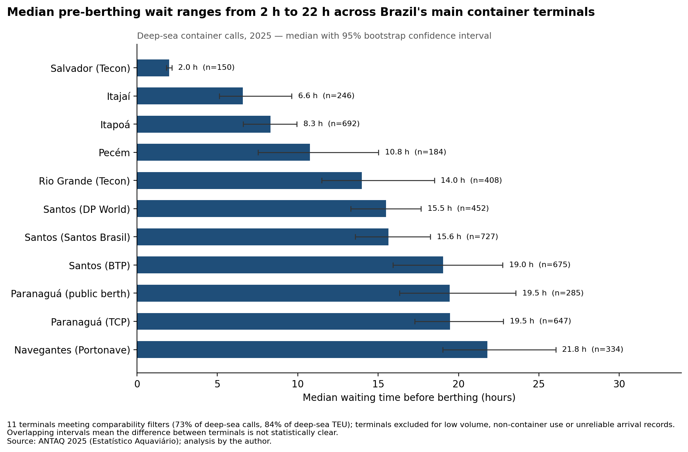

Only terminals with comparable records were ranked: at least 100 deep-sea calls, mainly container traffic, and arrival times that look like real arrivals rather than the berthing time copied over. That leaves **11 terminals, covering 73% of deep-sea calls and 84% of deep-sea TEU**. The confidence intervals come from 2,000 bootstrap resamples.

**Reading it:** where the intervals overlap (BTP and both Paranaguá terminals, around 19 h), the ranking between them is not meaningful.

**Caveat:** Salvador's 2 h is an outlier. It most likely reflects fixed berthing windows rather than a faster terminal, so it is not directly comparable with the others.

### 2. Ships spend more time waiting than working

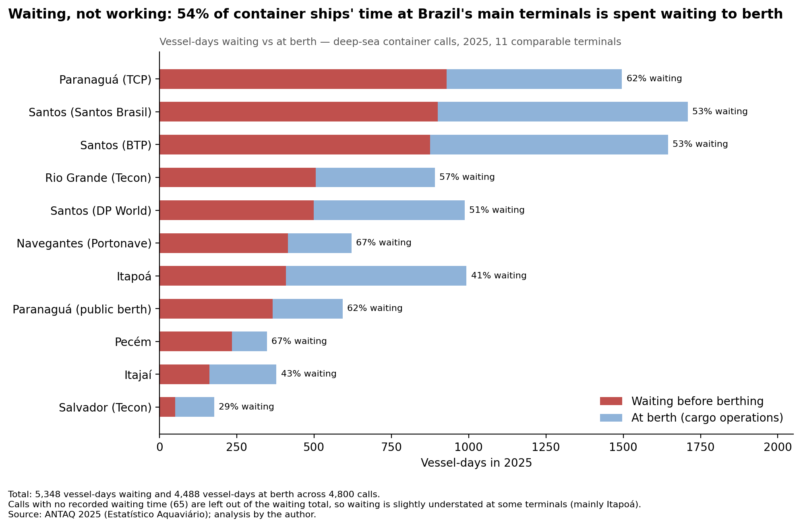

Across the 11 terminals: **5,348 vessel-days waiting** and **4,488 at berth**, over 4,800 calls. Pecém and Navegantes lose the largest share of their time to waiting (67%); Itapoá the lowest among the large terminals (41%).

**Caveat:** ANTAQ's waiting time includes congestion *and* ships that arrived early by choice (waiting for their window or for cargo cut-off). The data cannot separate the two. 65 calls have no recorded waiting time and are left out, so waiting is slightly understated.

### 3. Waiting rises in the second half every year

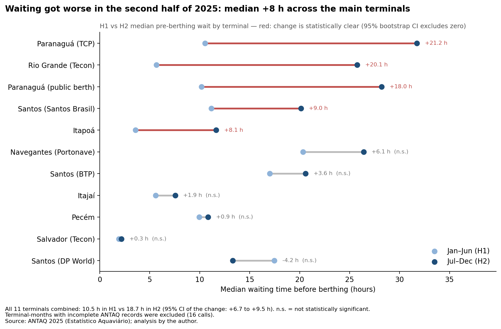

Median wait across the 11 terminals went from **10.5 h in H1 to 18.7 h in H2 2025** (95% CI of the change: +6.7 to +9.5 h). The increase is statistically clear at Paranaguá (both terminals), Rio Grande, Santos Brasil and Itapoá. Terminal-months with incomplete ANTAQ records were excluded (16 calls).

**Update with 2024 data (notebook 07):** the same rise happened in 2024 (+8.3 h, against +9.0 h in 2025 on the two-year base), so it is **seasonal, not a trend**. 2025 as a whole was calmer than 2024 (median 15.2 h vs 17.6 h), mainly because DP World Santos and Portonave were heavily congested in 2024.

### 4. Maersk and MSC are neck and neck

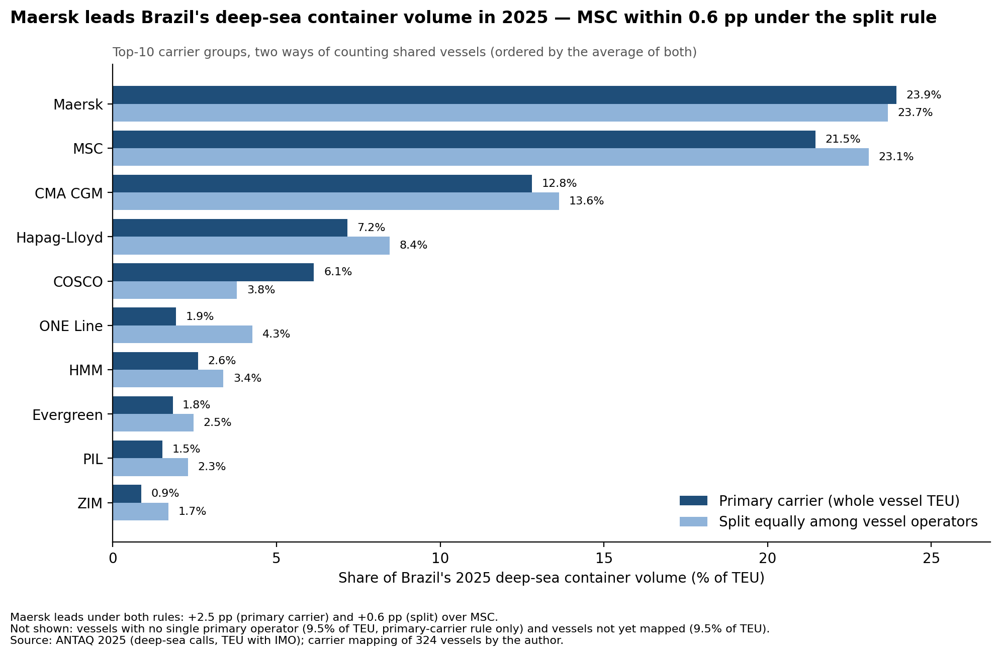

Many vessels on Brazil services are shared between carriers (vessel-sharing agreements), so market share depends on how a shared vessel's TEU is counted. Two rules were used:

- **Primary carrier:** the whole vessel counts for the carrier that runs the service.
- **Split:** the vessel's TEU is divided equally among all carriers on board.

| Carrier group | Primary carrier | Split |
|---|---|---|
| Maersk | 23.9% | 23.7% |
| MSC | 21.5% | 23.1% |
| CMA CGM | 12.8% | 13.6% |
| Hapag-Lloyd | 7.2% | 8.4% |
| COSCO | 6.1% | 3.8% |
| ONE | 1.9% | 4.3% |

**How sensitive is the order?** Three vessels had a debatable carrier assignment, so I re-ran the shares with each one moved:

| Scenario | Maersk − MSC, split rule |
|---|---|
| Table as published | +0.58 pp |
| LOG-IN EVOLUTION reassigned to Log-In (MSC group) — its operator is documented for only part of 2025 | +0.37 pp |
| SEASPAN EMPIRE reassigned to Hapag-Lloyd + Maersk | +0.72 pp |
| MSC MICHELA with its 2026 partners (MSC + Hapag-Lloyd + ZIM) | +0.73 pp |

Maersk stayed ahead in these three scenarios, and by 2.3–2.5 pp under the primary-carrier rule, but the margin under the split rule is smaller than the effect of two vessel assignments (see the update below). The unmapped tail (9.5% of TEU) is the other risk: under the split rule, MSC would need to take 6.2% more of that tail than Maersk, or the four largest unmapped vessels would all have to be MSC-only. Those four were checked, and none was.

**Update (October 2026).** A check of the 20 vessels that moved the most TEU found 18 correctly assigned and two that were not reliable. TIGER PLATA, a Rio Grande–River Plate feeder, was listed as shared by Maersk, KMTC, ONE and Hapag-Lloyd without a source to support it. MSC AGADIR was listed with its 2026 partners, while its name and its 2025 calls point to MSC. Correcting both would put MSC ahead of Maersk under the split rule by roughly 0.4 pp (an estimate, not yet recomputed). The two carriers are effectively tied, and the order between them should not be read as meaningful.

**What the two rules reveal:** ONE more than doubles under the split rule (1.9% → 4.3%). In Brazil it mostly buys space on other carriers' ships. COSCO does the opposite (6.1% → 3.8%): it is often the carrier running the service.

### 5. At least 16% moved on chartered-in vessels

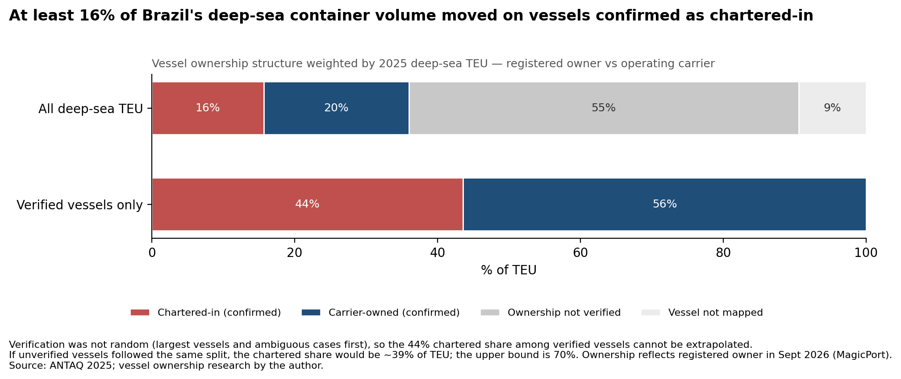

Of all deep-sea TEU, **16% moved on vessels confirmed as chartered-in**, 20% on vessels confirmed as carrier-owned, and 55% on vessels whose owner was not verified.

**The number to use is 16%, not 44%.** Among verified vessels, 44% of TEU was on chartered tonnage. But verification was not random: the largest and most ambiguous vessels were checked first. If unverified vessels followed the same split, the chartered share would be about 39%; the upper bound is 70%. Ownership reflects the registered owner in September 2026, not necessarily during 2025.

### 6. Empty dry boxes go out, empty reefers come in

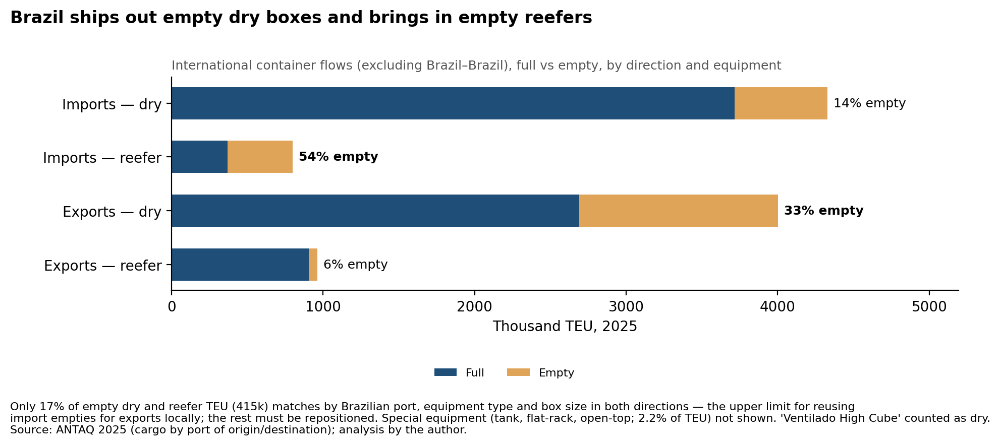

International flows (Brazil–Brazil excluded), by direction and equipment:

| | Full (k TEU) | Empty (k TEU) | % empty |
|---|---|---|---|
| Imports — dry | 3,715 | 613 | 14% |
| Imports — reefer | 370 | 430 | 54% |
| Exports — dry | 2,689 | 1,312 | 33% |
| Exports — reefer | 906 | 55 | 6% |

Brazil imports more dry cargo than it exports, so dry boxes leave empty. It exports far more refrigerated cargo (meat, fruit) than it imports, so reefers arrive empty to be loaded.

**How much could be reused locally?** Only **17%** of empty dry and reefer TEU (415k) matches by Brazilian port, equipment type and box size in both directions. That is the ceiling for reusing import empties for local exports; the rest has to be repositioned.

**Classification choice:** ANTAQ's *Ventilado High Cube* category (28% of all TEU) was counted as dry. It behaves like a port-level recording convention rather than genuinely ventilated cargo (tested in notebook 02, Bloco 21). The ISO box codes in the bulk files later confirmed it: ventilated boxes are practically zero.

### 7. A quarter of the trade goes through hubs

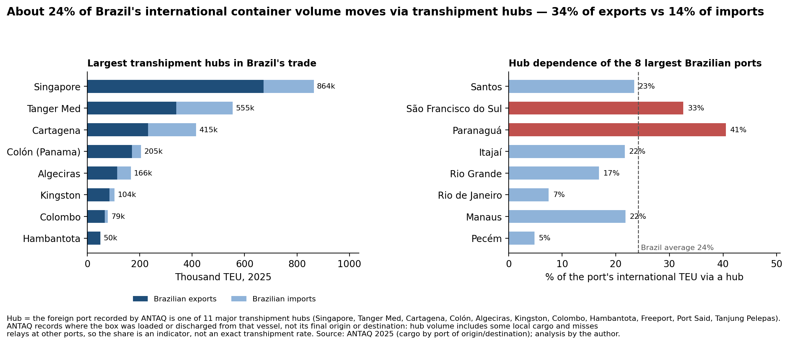

When the foreign port recorded by ANTAQ is one of 11 major transhipment hubs, the cargo is counted as "via hub". On that basis, **24.2%** of international TEU moves via a hub: **34.5% of exports** and **14.2% of imports**. Singapore (864k TEU), Tanger Med (555k) and Cartagena (415k) are the largest.

Among the eight largest Brazilian ports, **Paranaguá (41%)** and **São Francisco do Sul (33%)** depend most on hubs; Santos sits near the average (23%).

**Caveat:** ANTAQ records where the box was loaded or discharged from that vessel, not its final origin or destination. Hub volume therefore includes some local cargo and misses relays at ports outside the list. Treat 24% as an indicator, not an exact transhipment rate.

---

## Findings in detail — 2024–2025

### 8. Predicting the wait on arrival

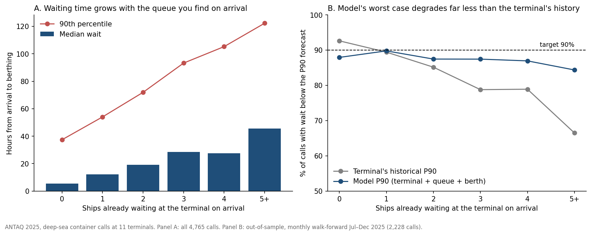

When a container ship arrives off one of the 11 terminals, can its wait be predicted better than from the terminal's recent history? The target is the hours from arrival to berthing, recomputed from the bulk-download timestamps. Each month from July to December 2025 is predicted by a model trained only on calls that had already berthed before that month. Nothing known after arrival is used.

| Model | Mean abs. error | Median abs. error | Error on waits > 48 h |
|---|---|---|---|
| Terminal median | 25.7 h | 13.3 h | 76.9 h |
| Terminal median, last 30 days | 24.9 h | 14.5 h | 66.8 h |
| Lookup table: terminal × queue × berths occupied | 23.9 h | 12.3 h | 68.8 h |
| **Gradient boosting: terminal + queue + berths occupied** | **23.1 h** | **11.6 h** | **66.5 h** |

- The model beats the 30-day rolling median by about **1.8 h per call** (95% CI 1.3–2.3 h, weekly block bootstrap), in all six test months.
- What drives it is **how many ships are already waiting, and how many are alongside, when you arrive**. A plain lookup table captures about half of the gain.
- With five or more ships waiting, the terminal's historical P90 is exceeded in one call out of three; the model's in about one out of six.

**Where it stops:** measured 48 hours before arrival, the queue loses most of its signal and the model is no better than the baseline. It does not anticipate congestion (no significant gain on waits above 48 h), and its P90 covers about 88% of calls, not 90%. Notebook 10 retests it on a year it never saw (finding 13).

### 9. Empty boxes leaving Brazil

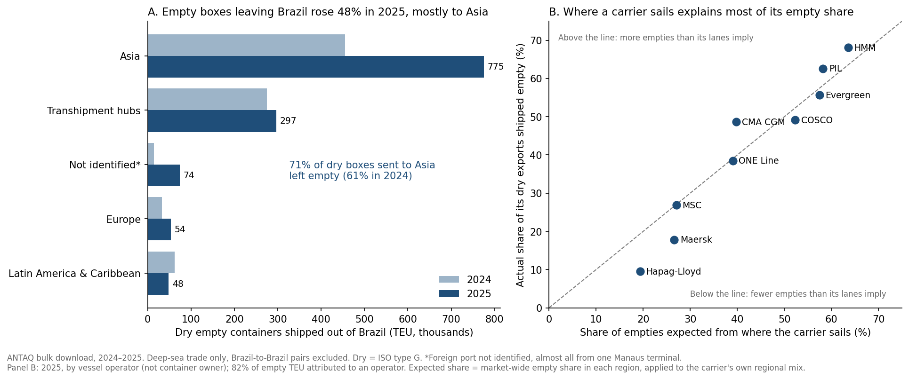

This project started from one question: how many empty containers leave Brazil, where they go, and who carries them.

- **Dry empty exports grew 48% in 2025** (847k → 1,258k TEU), far faster than dry imports (+12%). Asia takes 62% of them.
- **Seven in ten dry boxes sent to Asia leave empty** (71%, up from 61%). For China alone it is three in four: almost three empties for every full box. The ratio of full imports to full exports with China barely moved (6.5:1 → 6.6:1); what jumped was the number of empties sent back.
- **Two clusters send most of them:** the Santos complex (37%) and Santa Catarina (Portonave, Itapoá, Itajaí, 25%).
- **Where a carrier sails explains most of how many boxes it ships empty.** On the Asia lane every operator sends 58–80% of dry boxes back empty; across all lanes the range is 10–68%. The lane mix alone reproduces each operator's empty share closely (r = 0.97, nine operators). Maersk and Hapag-Lloyd ship about 9–10 points fewer empties than their lanes imply, CMA CGM about 9 points more, mostly through hubs.

**Caveats:** the maritime balance does not close (350–460k more dry TEU enter than leave by sea each year, most likely leaving by land or through excluded transhipment categories), so this is about flows, not a stock building up. About 60k TEU of 2025 empties go to an unidentified foreign port, almost all from one Manaus terminal. Asia's share is a lower bound, because hub-bound empties are counted separately.

### 10. What drives the wait

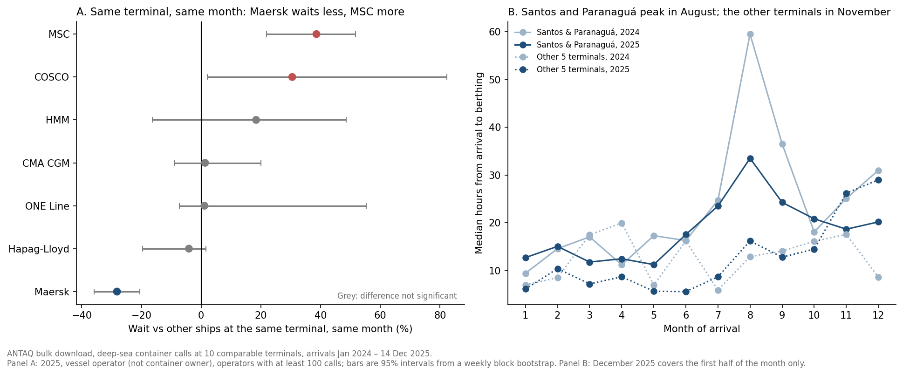

Two years, 10 comparable terminals (Itajaí drops out: 32 calls in 2024).

- **Same terminal, same month: Maersk waits about 28% less than other ships, MSC about 39% more** (95% intervals −36% to −21% and +22% to +52%). The gap holds within the same vessel class (Neo-Panamax: Maersk −32%, MSC +35%, 600+ calls each). By alliance: Gemini −25%, Ocean Alliance +20%.
- **Santos and Paranaguá peak in August, both years; the other terminals in November.** August brings fewer arrivals, not more, yet the longest and slowest queue of the year: berthing capacity drops. Non-container traffic does not explain it in Santos and only weakly in Paranaguá.
- **Vessel size matters less than terminal and month.** Relative to other ships at the same terminal and month, large ships show no extra peak-season penalty once MSC is taken out.
- **Maersk is also the most predictable:** Neo-Panamax P90 of 38 h, against 77 h for MSC.

**Caveat:** association, not cause. The carrier gap may come from berth-window agreements, rotation design or a policy of arriving early.

### 11. Berth productivity

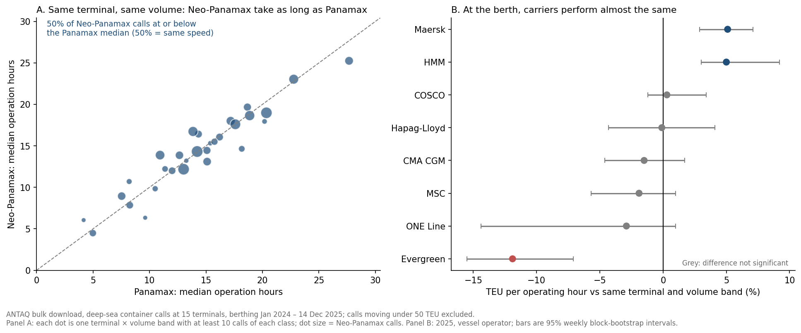

Operation time from ANTAQ's logged start and end of cargo work, 15 terminals, compared within the same terminal and band of TEU moved.

- **Volume drives berth time.** Ten times the volume takes roughly five times as long (2.2 operating hours per 100 TEU below 500 TEU; 0.6 above 5,000).
- **A bigger ship is not faster at the berth.** At the same terminal and volume, 50.1% of 2,081 Neo-Panamax calls finish at or below the Panamax median, where 50% means identical speed.
- **Carriers perform almost the same.** Maersk and HMM run about 5% faster, Evergreen about 12% slower, the rest show no significant difference. MSC's longer waits are in the queue, not at the quay.
- **Portonave has the fastest operations** (about 219 TEU per operating hour, consistent with its berth times) and some of the longest waits: its bottleneck is before berthing.

### 12. The fleet that serves Brazil

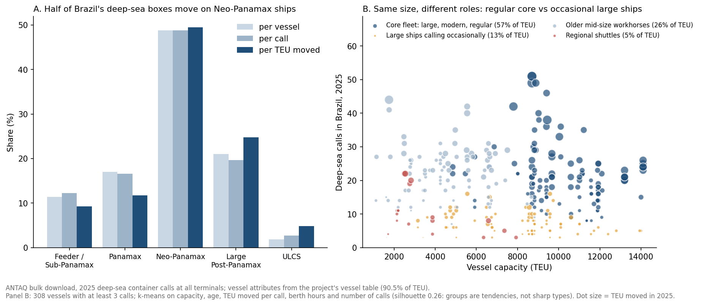

The typical vessel in Brazil's deep-sea container trade is a **Neo-Panamax of about 8,000–8,700 TEU, 299 m long, 11–12 years old**, carrier-owned, flagged in Liberia and run by Maersk or MSC. It moves about 1,600 TEU per call, around a fifth of its capacity.

Clustering 308 vessels on capacity, age, TEU per call, berth hours and number of calls gives four groups that describe a ship's role more than its size: a **core fleet** (117 vessels, 9 years old, 9% chartered, **57% of TEU**), **older mid-size workhorses** (17 years, 26% of TEU), **large ships calling occasionally** (7 calls a year, 37% chartered) and a small group of **regional shuttles**. The groups are weak (silhouette 0.21–0.26): they are tendencies, not sharp types.

### 13. Forecasting a year ahead, and arrival punctuality

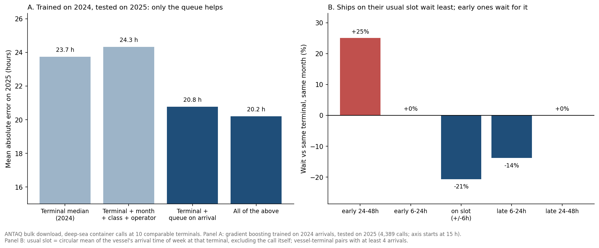

Models trained on 2024 only, tested on every 2025 call.

| Model | Mean error on 2025 | vs terminal median |
|---|---|---|
| Terminal median (2024) | 23.7 h | — |
| Terminal + month + class + operator | 24.3 h | +0.6 h (−0.0 to +1.2) |
| Terminal + queue on arrival | 20.8 h | **−3.0 h** (−3.6 to −2.4) |

- **Vessel class, month and carrier alone do not beat the terminal median.** The queue on arrival does, in a year the model never saw. Once the queue is known, the operator adds about 0.5 h; month and class add nothing, because the queue already reflects the season.
- **Arrival punctuality**, used instead of contractual berth windows (not public): ships arriving within 6 h of their usual weekly slot wait about **21% less** than others at the same terminal and month; ships more than a day early wait about 25% more, mostly for their own window. Late arrivals do not wait longer than average.
- **Punctuality explains about half of the MSC–Maersk gap.** Maersk vessels arrive on their slot 30% of the time, MSC vessels 15%.

**Caveat:** the usual slot is inferred, and arrival time partly reflects berth planning (ships slow down when the berth is not ready), so punctuality and waiting influence each other.

### 14. Size, cargo and timing of the equipment mismatch

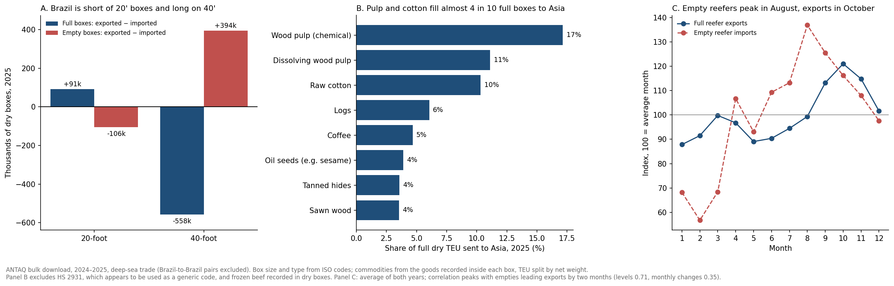

- **Brazil is short of 20-foot boxes and long on 40-foot ones.** 36% of full dry export boxes are 20-foot, against 23% of imports. In 2025, 168k empty 20' boxes came in and 598k empty 40' boxes went out. Almost all of the 2025 jump in empty exports (+406k of +411k TEU) was 40-foot.
- **Exports run out of weight before space.** A full 40' export box weighs about the same as a full 20' (26.4 t vs 25.3 t gross), so exporters prefer 20' while imports arrive in 40'.
- **The full boxes going to Asia depend on a few raw materials:** wood pulp (28%) and raw cotton (10%) fill almost 4 in 10. Imports from Asia are far more varied (solar modules and semiconductors, chips, pesticides, tyres, cars).
- **Empty reefers arrive about two months ahead of the export peak** (August vs October). Chicken, flat across the year, is about half of the main reefer exports.

### 15. Carrier concentration by terminal and port

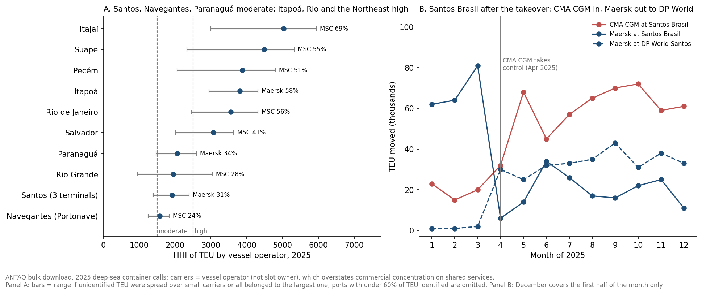

TEU-weighted HHI by vessel operator, 2025 (83–89% of TEU identified at the main terminals).

- **Every big terminal has an anchor carrier:** MSC at BTP (44%), Multi-Rio (85%) and Itajaí (69%); Maersk at Itapoá (58%), TCP Paranaguá (34%) and DP World Santos (43%); CMA CGM at Santos Brasil (36%).
- **Santos, Navegantes and Paranaguá are moderately concentrated as ports; Itapoá, Rio de Janeiro and the Northeast ports are highly concentrated.** Santos as a whole (HHI 1,911) is less concentrated than any of its three terminals. For shippers, carrier choice sits at port level.
- **Nationally, HHI is about 1,900 by carrier and 2,100 by alliance block.**
- **Santos Brasil after the CMA CGM takeover:** CMA CGM's share of the terminal went from 19% (January–April 2025) to 43% (May–December), and Maersk's from 45% to 15%. Maersk did not leave Santos; it moved volume to DP World Santos and BTP. The switch came in April–May, after the change of control and not with the Gemini start in February; timing, not proof of cause.

**Caveat:** operator-based concentration overstates commercial concentration on shared services. 2024 coverage (20–71%) is too low for a before-and-after comparison. These figures replace the call-based HHIs in two earlier posts (see the correction notes in [brazilian-maritime-analysis-2025](https://github.com/hugopedro-ds/brazilian-maritime-analysis-2025)).

### 16. Weekends, and how long congestion lasts

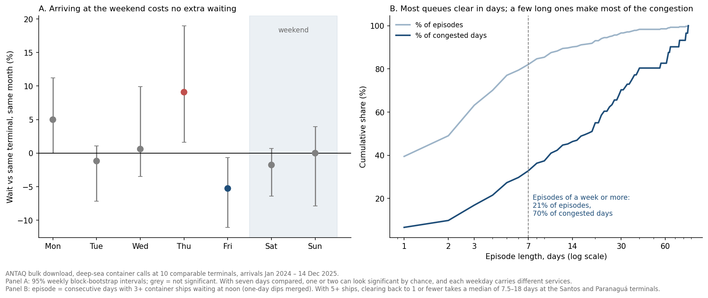

- **No weekend penalty.** Ships arriving on Saturday or Sunday wait the same as others at the same terminal and month, and terminals berth ships at the same pace every day (97–106 berthings per 100 arrivals on each weekday).
- **At the big Santos and Paranaguá terminals, three ships waiting is the normal state** (more than half of all days). With five or more waiting, clearing back to one or none takes a median of **7.5–18 days**. Itapoá reaches five ships waiting on under 2% of days.
- **One congestion episode in five lasts a week or more, and those make up 70% of all congested days.** Long episodes start mostly between June and October.

**Caveat:** the queue is counted once a day, at noon; weekday comparisons mix day and service, because weekly services arrive on fixed days.

### 17. Time at sea before arrival

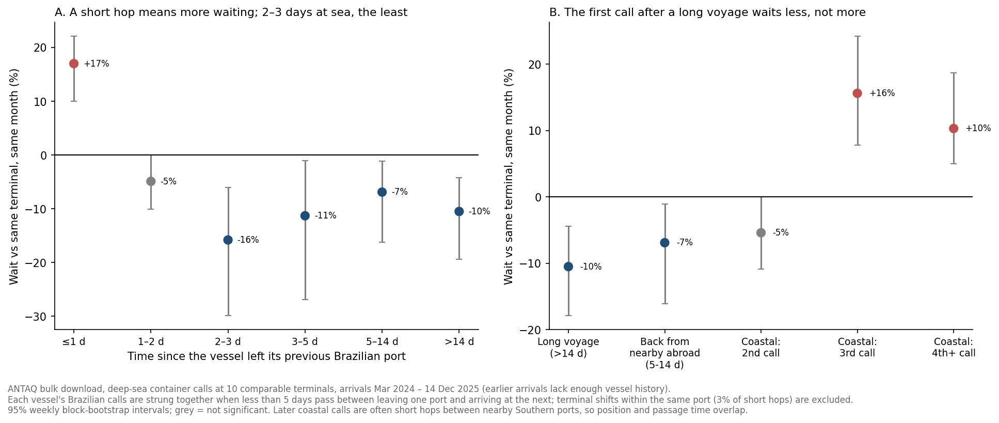

ANTAQ does not record where a ship comes from, so each vessel's Brazilian calls were strung together from their dates, and every arrival classified by the time since the vessel left its previous Brazilian port.

- **After a long voyage (over 14 days), ships wait about 10% less** than others at the same terminal and month.
- **After a hop of a day or less from a nearby Brazilian port, they wait about 17% more** (about 9% more with the same queue on arrival). After 2–3 days at sea, about 16% less.
- Terminal shifts within the same port are not the explanation (3% of short hops).

**Likely reading (not proven):** with two or three days at sea a ship can slow down and arrive when the berth is ready; a few hours from the next port, it waits at anchor instead. Where ports sit close together, as in the South, the anchorage absorbs schedule gaps a longer passage would absorb at sea.

### 18. Berth occupancy and waiting

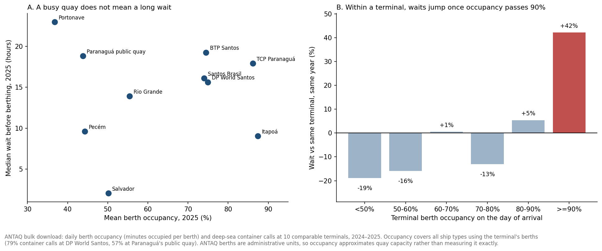

ANTAQ's daily berth occupancy (minutes each berth is occupied) matches the berth time of the calls exactly (median ratio 1.000).

- **Within a terminal, waits barely react below 80–90% occupancy and jump above it:** about +42% when the terminal is at 90% or more on the day of arrival.
- **Itapoá and TCP Paranaguá run hottest** (86–87% mean occupancy in 2025, above 85% on more than 70% of days).
- **A busy quay is not the whole story.** Itapoá combines the highest occupancy with one of the shortest waits. Portonave never passed 85% on any day in two years and still has one of the longest waits: its constraint is access, not the quay.
- **The August peak has different causes by terminal.** At TCP, arrivals fall but ships stay 30–73% longer at the berth; at Paranaguá's public quay, other cargo fills the berths at the grain peak; at DP World Santos and Itapoá (2024), waits rise with no change in occupancy, so the cause lies outside the quay.

**Caveat:** ANTAQ berths are administrative units, so occupancy approximates quay capacity. Six of the ten terminals record no stoppages at all, so the reason for slower August operations at TCP is not identified.

---

## Data quality notes

Things worth knowing if you use ANTAQ data yourself:

- **The panel hides the longest waits.** Values shown as *Valor Discrepante* are not random errors: at every terminal where they appear, the smallest hidden wait is longer than the longest visible one. Recomputed from the bulk-download timestamps, most are real long waits. Findings 1–3 use the panel values, so upper percentiles there are lower bounds.
- **Some terminals log arrival at berthing time.** Rio de Janeiro (Multi-Rio, ICTSI), Suape and Itaguaí record arrival almost at berthing in 2025, so their waits are not comparable. Multi-Rio changed practice between 2024 and 2025, which is why the terminal rules are applied to each year separately.
- **"Ventilado High Cube" is a recording convention**, not a cargo type (confirmed by ISO box codes).
- **HS 2931 is used as a generic code.** About 325k TEU of 2025 exports carry this chemicals code, 26% of them in reefers and bound mostly for hubs. It is excluded from commodity tables.
- **Old port codes still in use.** Tanger Med appears under both `MAPTM` and `MATNG` (the old Tangier code). Without merging them, Africa looks twice as large.
- **Stoppage records are incomplete.** Six of the ten comparable terminals record no stoppages at all in 2024–2025.
- **Reefer capacity estimates are not reliable at vessel level** (observed/estimated median 0.63 for 11 vessels). No finding depends on them.

---

## Limitations

- **Two years at most.** Enough to separate a repeated seasonal pattern from a one-off; not enough to call anything a long-term trend.
- **No AIS data.** Waiting time is ANTAQ's recorded arrival-to-berthing time, not a measured anchorage time, and it includes deliberate early arrivals.
- **Carrier = vessel operator,** from a manual mapping covering 90.5% of 2025 TEU and about 71% of 2024 TEU. Carrier results rely mainly on 2025.
- **Last port, not final destination.** Corridors and hub shares depend on where the box was loaded or discharged.
- **Association, not cause,** throughout. Where a result could be read causally (carrier gaps, the Santos Brasil switch), the alternative explanations are stated next to it.
- **Ownership is verified for 181 of 324 vessels**, and registered owner is not beneficial control.

---

## Repository structure

```
├── README.md
├── notebooks/
│   ├── 02_pipeline_antaq.ipynb           # 2025 analysis from the panel extracts (findings 1–7)
│   ├── 03_edicao_tabela_armadores.ipynb  # how the carrier table was built, vessel by vessel
│   ├── 04_wait_time_model.ipynb          # waiting-time model within 2025 (finding 8)
│   ├── 05_two_year_base.ipynb            # 2024–2025 base from the bulk download, validated against 2025
│   ├── 06_empty_flows.ipynb              # empties by region, port and operator (finding 9)
│   ├── 07_wait_drivers.ipynb             # carrier, size, season and terminal effects on waiting (finding 10)
│   ├── 08_berth_productivity.ipynb       # operation time by volume, class and carrier (finding 11)
│   ├── 09_fleet_profile.ipynb            # typical vessel and fleet groups (finding 12)
│   ├── 10_wait_prediction_v2.ipynb       # out-of-year forecast and arrival punctuality (finding 13)
│   ├── 11_equipment_mismatch.ipynb       # box size, cargo inside the box, reefer timing (finding 14)
│   ├── 12_carrier_concentration.ipynb    # TEU-weighted concentration by terminal and port (finding 15)
│   ├── 13_weekday_and_congestion.ipynb   # weekend effect and congestion episodes (finding 16)
│   ├── 14_rotation_position.ipynb        # time at sea before arrival and waiting (finding 17)
│   └── 15_berth_occupancy.ipynb          # berth occupancy, waiting and the August peak (finding 18)
├── data/
│   ├── raw/                              # empty — ANTAQ files go here (see data/raw/README.md)
│   └── processed/
│       ├── tabela_completa.csv           # carrier and ownership table (324 vessels)
│       ├── calls_2025.csv                # 2025 calls, written by notebook 02 for notebook 04
│       ├── calls_2024_2025.csv           # container calls 2024–2025, written by notebook 05
│       ├── trade_flows_2024_2025.csv.gz  # deep-sea container flows by call and foreign port, written by notebook 05
│       ├── navios_descartados.csv        # vessels removed, with the reason
│       ├── imos_prioritarios.csv         # vessel priority list used for the research
│       └── tabela_referencia_262.csv     # earlier snapshot, used for a consistency check
└── outputs/
    └── figures/                          # the 18 figures above
```

Code comments and printed outputs are in Portuguese in notebooks 02 and 03 and in English from notebook 04 on. Figures and this README are in English.

---

## Reproducing the analysis

1. Install the dependencies: `pip install pandas numpy matplotlib openpyxl python-calamine scikit-learn`
2. **For findings 1–8:** export the five 2025 panel extracts into `data/raw/` (see [`data/raw/README.md`](data/raw/README.md)), then run `notebooks/02_pipeline_antaq.ipynb`. Its last block writes `calls_2025.csv`, which notebook 04 reads together with the 2025 bulk-download calls file.
3. **For findings 9–18:** download the 2024 and 2025 bulk files listed in `data/raw/README.md`, run `notebooks/05_two_year_base.ipynb` first (it writes the two-year base), then any of notebooks 06–15.

The notebooks find the project folder on their own; no paths to edit. Notebook 03 documents how the carrier table was built: every block that writes to the table checks first and does nothing if its vessels are already there.

ANTAQ revises its data, so an export made later may differ slightly from the figures here.

---

## Related work

- [brazilian-maritime-analysis-2025](https://github.com/hugopedro-ds/brazilian-maritime-analysis-2025) — earlier study; parts corrected in September 2026 (see the note at the top of its README)
- [brazil-westafrica-container-corridor](https://github.com/hugopedro-ds/brazil-westafrica-container-corridor) — Brazil → West and Central Africa container trade

## Author

**Hugo Pedro** — São Paulo, Brazil. 17+ years in international freight forwarding and ocean freight procurement; now working on trade-lane analytics.
[LinkedIn](https://www.linkedin.com/in/hugopedro/)
